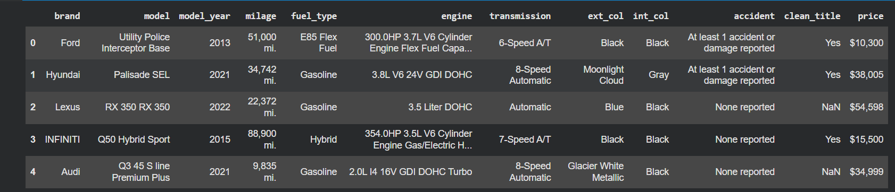
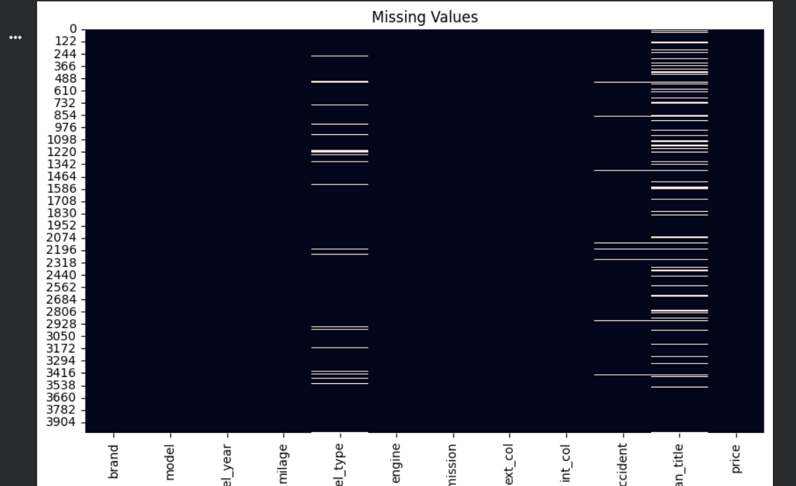
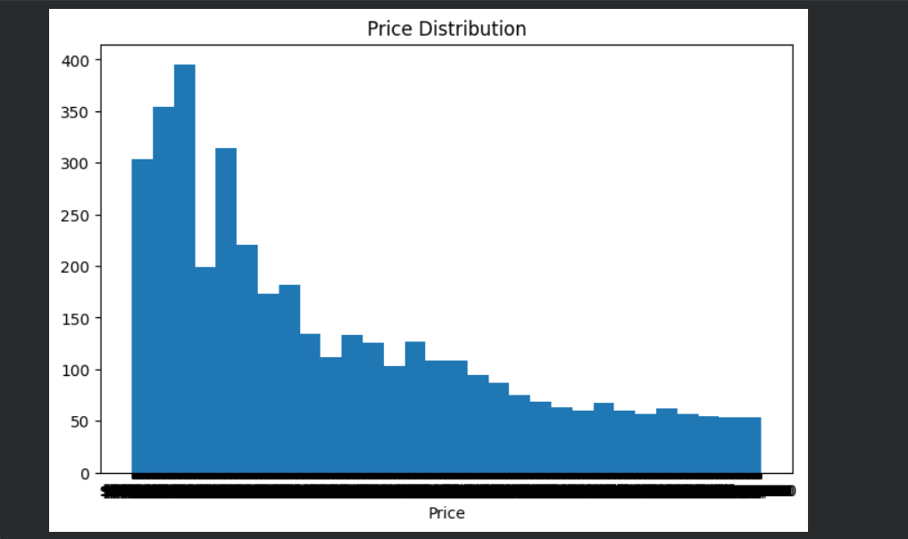
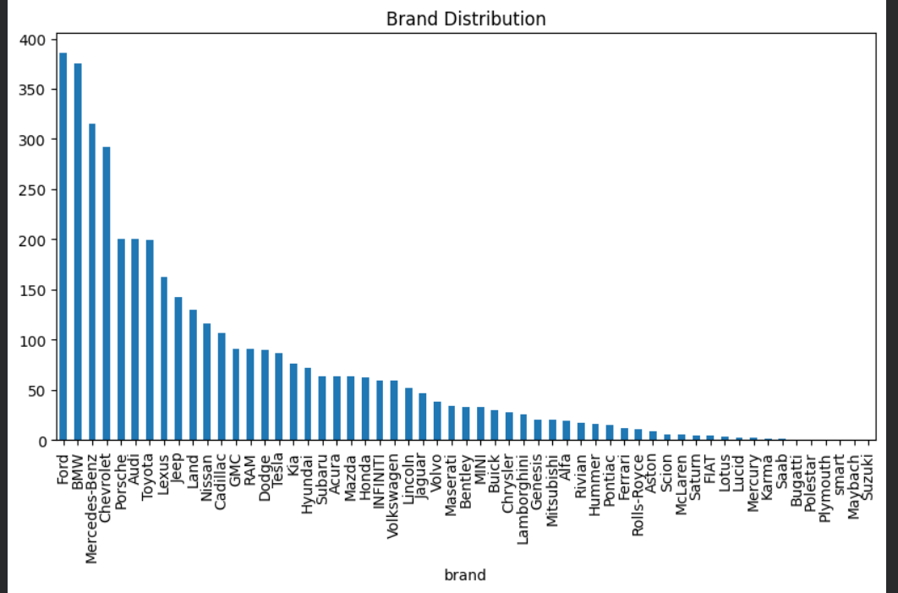
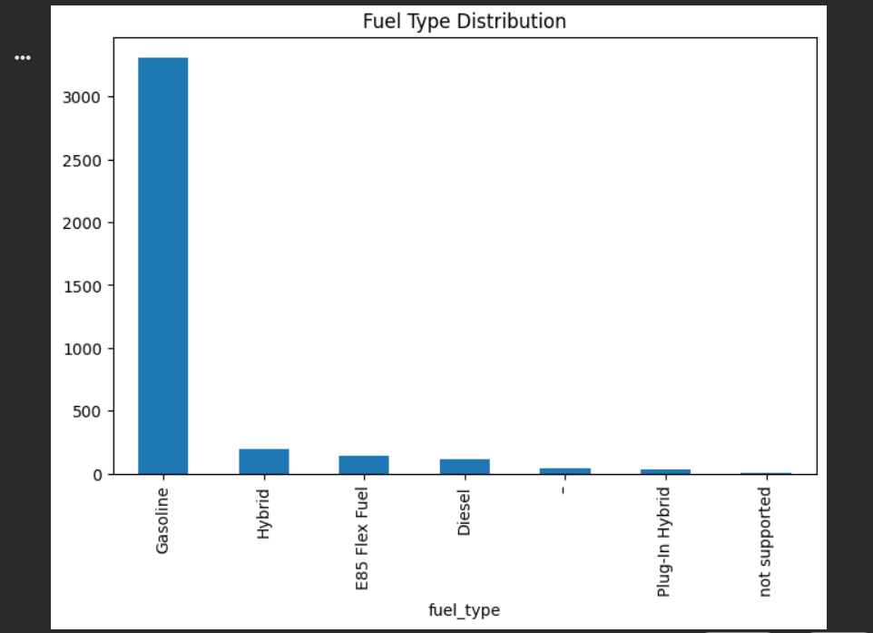
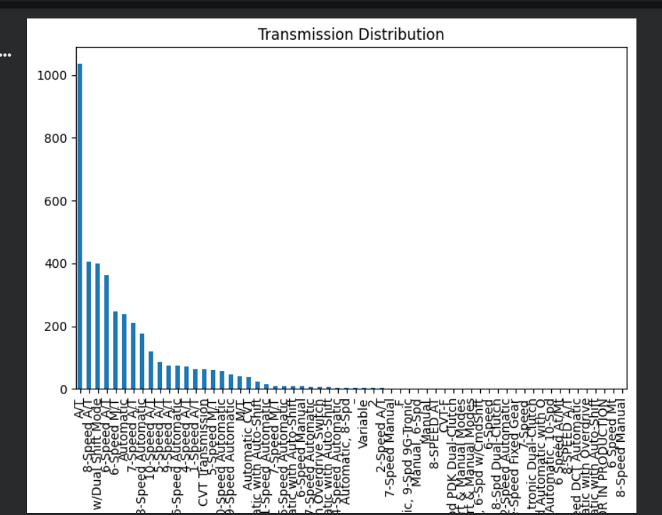
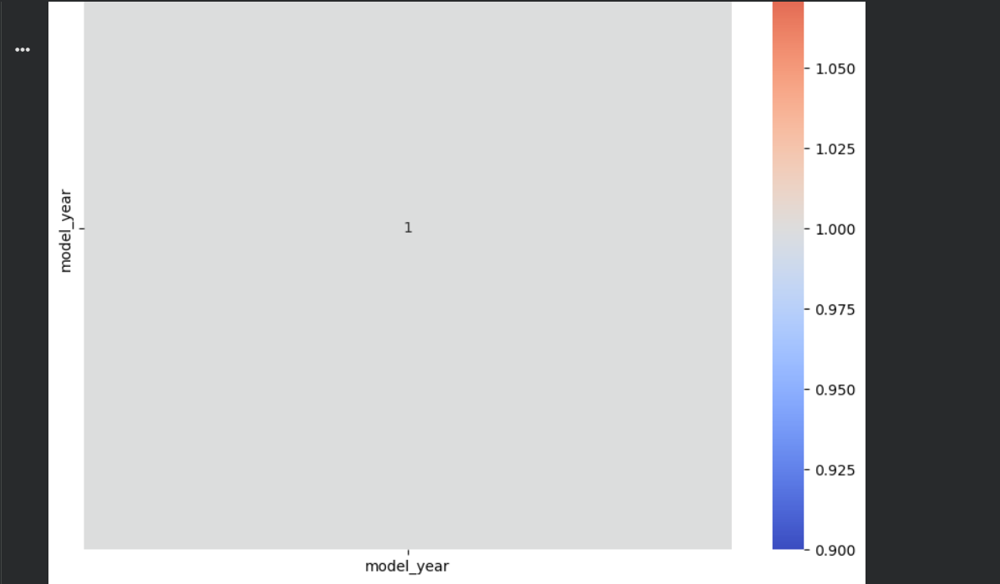
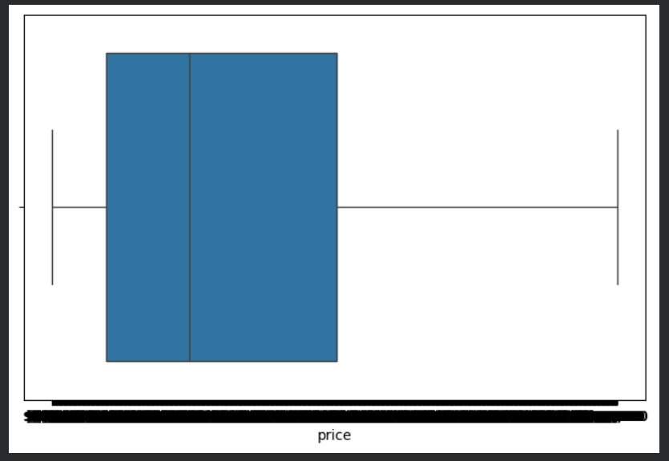
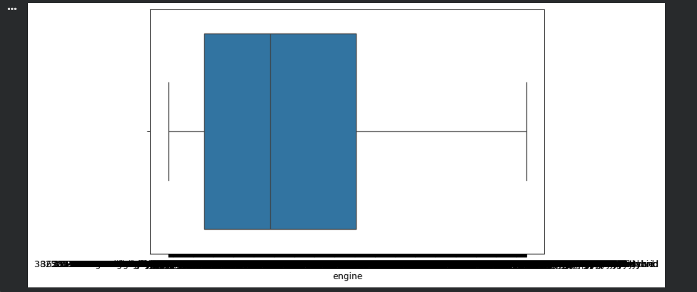

# 🚗 Used Car Price Prediction – Data Preprocessing & Feature Engineering

## 📌 Project Overview

This project focuses on preparing a real-world used car dataset for future machine learning applications through Exploratory Data Analysis (EDA), Data Cleaning, and Feature Engineering. The objective is to understand the dataset, improve data quality, create meaningful features, and produce a clean dataset suitable for predictive modeling.

---

# 📂 Dataset Overview

The **Used Car Price Prediction Dataset** contains information about used vehicles listed for sale, including vehicle specifications, condition, and selling price.

### Dataset Features

- Brand
- Model
- Model Year
- Mileage
- Fuel Type
- Engine
- Transmission
- Exterior Color
- Interior Color
- Accident History
- Clean Title Status
- Price (Target Variable)

The dataset is intended for building machine learning models capable of predicting the resale value of used cars.

---

# 🎯 Project Objectives

The following tasks were completed as part of this project:

### 📊 Exploratory Data Analysis (EDA)

- Explored the dataset structure
- Identified numerical and categorical features
- Performed descriptive statistical analysis
- Checked missing values
- Checked duplicate records
- Analyzed unique values of categorical features
- Identified potential outliers
- Visualized important feature distributions
- Documented key insights

### 🧹 Data Cleaning

- Handled missing values using appropriate techniques
- Removed duplicate records
- Converted incorrect data types into numerical format
- Cleaned numerical columns (Price, Mileage, Engine)
- Removed outliers using the Interquartile Range (IQR) method

### ⚙️ Feature Engineering

The following new features were created to improve future machine learning performance:

- Vehicle Age
- Price per Mile
- Luxury Brand Indicator
- High Mileage Indicator
- Vehicle Age Group

---

# 🛠️ Technologies Used

- Python
- Google Colab
- Pandas
- NumPy
- Matplotlib
- Seaborn

---

# 📊 Exploratory Data Analysis (EDA)

The following analyses were performed during EDA:

- Dataset Shape
- Dataset Information
- Data Types Analysis
- Numerical & Categorical Feature Identification
- Missing Value Analysis
- Duplicate Record Analysis
- Summary Statistics
- Unique Value Analysis
- Price Distribution
- Brand Distribution
- Fuel Type Distribution
- Transmission Distribution
- Correlation Heatmap
- Outlier Detection using Boxplots

---

# 📷 Analysis Screenshots

## Dataset Information



---

## Missing Value Analysis



---

## Price Distribution



---

## Brand Distribution



---

## Fuel Type Distribution



---

## Transmission Distribution



---

## Correlation Heatmap



---

## Price Outlier Detection



---

## Mileage Outlier Detection


---

## Engine Outlier Detection




# 🧹 Data Quality Issues Identified

The following issues were identified in the dataset:

- Missing values in multiple columns
- Duplicate records
- Numerical columns stored as object (string) data types
- Outliers in Price, Mileage, and Engine columns
- Inconsistent formatting in numerical values

---

# 🔧 Cleaning Techniques Applied

The following preprocessing techniques were applied:

- Filled missing numerical values using the median.
- Filled missing categorical values using the mode.
- Removed duplicate records.
- Converted Price, Mileage, and Engine columns to numeric data types.
- Removed outliers using the Interquartile Range (IQR) method.
- Verified the cleaned dataset for consistency.

---

# ⚙️ Feature Engineering Performed

Five meaningful features were created to enhance future predictive models:

| Feature | Description |
|----------|-------------|
| Vehicle Age | Calculates the age of the vehicle from the model year |
| Price per Mile | Calculates the price relative to the mileage driven |
| Luxury Brand | Indicates whether the vehicle belongs to a luxury brand |
| High Mileage | Indicates whether the vehicle has been driven more than 100,000 miles |
| Age Group | Categorizes vehicles into New, Moderate, Old, and Very Old groups |

---

# 📈 Visualizations

The following visualizations were created during the analysis:

- Price Distribution
- Brand Distribution
- Fuel Type Distribution
- Transmission Distribution
- Correlation Heatmap
- Price Outlier Detection
- Mileage Outlier Detection
- Engine Outlier Detection

---

# 💡 Key Insights

### 1.

Vehicle price generally decreases as mileage increases, indicating a negative relationship between vehicle usage and resale value.

### 2.

Newer vehicles tend to have higher resale prices compared to older vehicles.

### 3.

Luxury vehicle brands generally command higher resale prices than non-luxury brands.

### 4.

Most listings belong to a relatively small number of popular brands, indicating an uneven distribution across manufacturers.

### 5.

After cleaning missing values, correcting data types, removing duplicates, and handling outliers, the dataset became significantly more suitable for machine learning applications.

---

# 📁 Repository Structure

```
Day-3/
│
├── task-3.ipynb
├── cleaned_used_cars.csv
├── README.md
└── images/
    ├── price_distribution.png
    ├── brand_distribution.png
    ├── fuel_distribution.png
    ├── transmission_distribution.png
    ├── correlation_heatmap.png
    ├── price_boxplot.png
    ├── mileage_boxplot.png
    └── engine_boxplot.png
```

---

# 🎯 Conclusion

This project demonstrates a complete data preprocessing pipeline for a real-world used car dataset. Through Exploratory Data Analysis, data cleaning, and feature engineering, the dataset was transformed into a structured and high-quality format suitable for future machine learning model development. The engineered features and cleaned data provide a strong foundation for building accurate used car price prediction models.

---

# 📚 Dataset

**Used Car Price Prediction Dataset**

https://www.kaggle.com/datasets/taeefnajib/used-car-price-prediction-dataset
