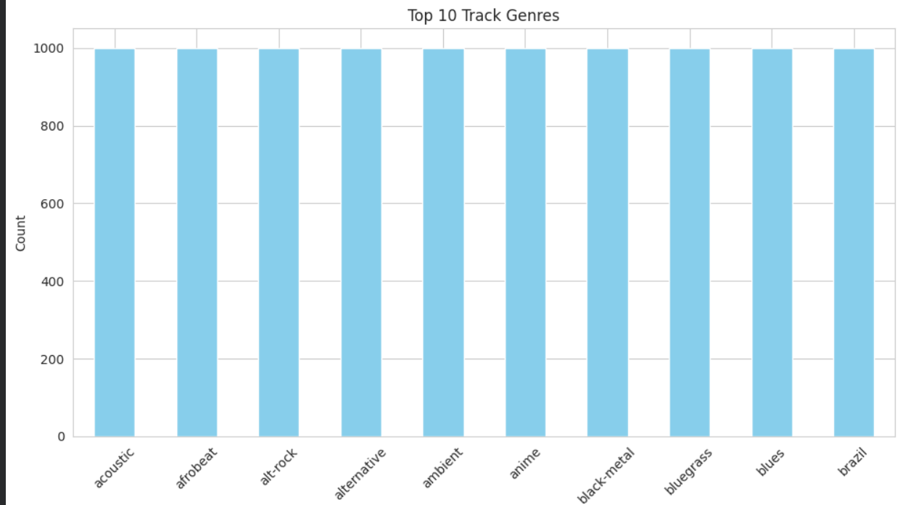
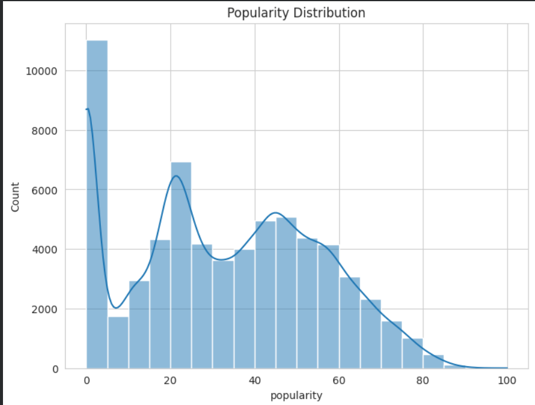
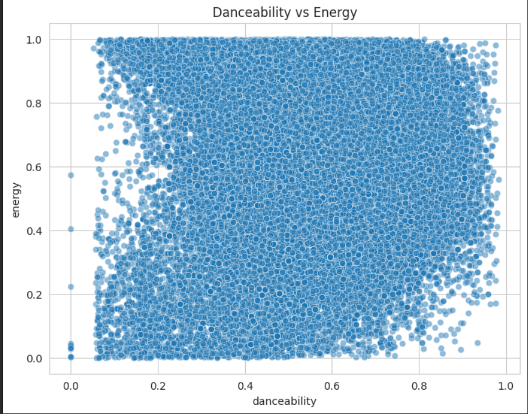
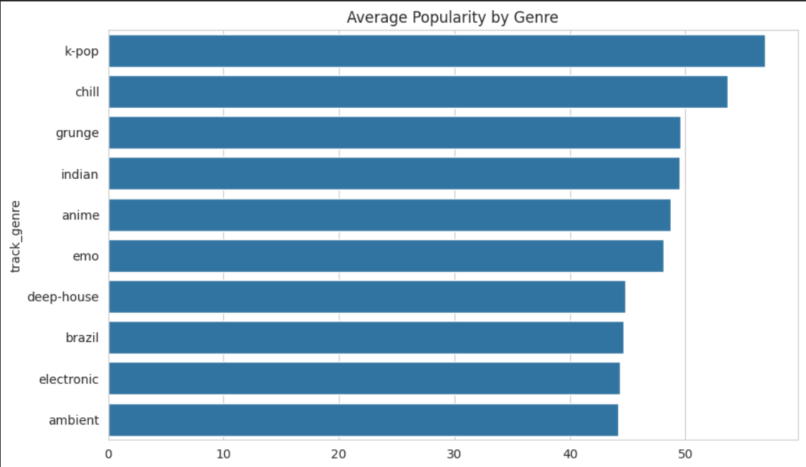
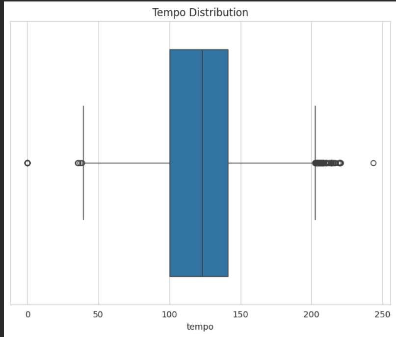
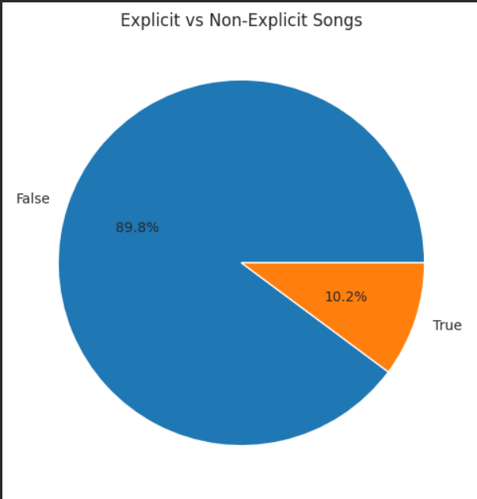

# 🎵 Spotify Tracks Dataset - Exploratory Data Analysis & Data Visualization

## 📌 Project Overview

This project presents an Exploratory Data Analysis (EDA) and visualization of the Spotify Tracks Dataset. The objective is to understand the structure of the dataset, identify important trends, analyze relationships between different audio features, and communicate meaningful insights through effective data visualizations.

The analysis was performed using **Python**, **Pandas**, **Matplotlib**, and **Seaborn** in **Google Colab**.

---

## 📂 Dataset

**Dataset:** Spotify Tracks Dataset

The dataset contains information about thousands of Spotify songs, including their popularity, genre, danceability, energy, tempo, loudness, explicit content, and many other audio features.

The analysis includes:

- Dataset exploration
- Data cleaning
- Statistical summary
- Missing value analysis
- Duplicate record analysis
- Relationship analysis
- Data visualization
- Insight generation

---

## 🛠️ Technologies Used

- Python
- Google Colab
- Pandas
- NumPy
- Matplotlib
- Seaborn

---

# 📊 Exploratory Data Analysis

The following EDA steps were performed:

- Loaded the dataset
- Explored dataset dimensions
- Inspected data types
- Generated descriptive statistics
- Identified numerical and categorical features
- Checked for missing values
- Checked for duplicate records
- Examined feature correlations

---

# 📈 Visualizations & Insights

## 1. Top 10 Track Genres



### Insight

- A small number of genres dominate the dataset.
- Pop and related genres contain the largest number of tracks.
- Several genres have comparatively fewer songs.

---

## 2. Popularity Distribution



### Insight

- Most songs have medium popularity.
- Extremely popular tracks are relatively rare.
- The popularity distribution is moderately skewed.

---

## 3. Danceability vs Energy



### Insight

- Danceable songs generally exhibit moderate to high energy.
- There is a positive relationship between danceability and energy.
- Some exceptions indicate diversity in musical styles.

---

## 4. Average Popularity by Genre



### Insight

- Certain genres consistently achieve higher average popularity.
- Genre has a noticeable influence on song popularity.
- Popularity varies significantly across different music categories.

---

## 5. Tempo Distribution



### Insight

- Most songs fall within a moderate tempo range.
- Several outliers represent exceptionally fast or slow tracks.
- Tempo values show a concentrated distribution.

---

## 6. Explicit vs Non-Explicit Songs



### Insight

- Non-explicit songs make up the majority of the dataset.
- Explicit tracks represent a smaller portion of the overall collection.

---

# 📌 Key Findings

- The dataset contains a diverse collection of music genres.
- Song popularity is unevenly distributed, with only a small fraction of tracks being highly popular.
- Danceability and energy exhibit a positive relationship.
- Musical genre influences average popularity.
- Tempo remains relatively consistent across most tracks.
- Non-explicit songs dominate the dataset.

---

# 📚 Conclusion

Through Exploratory Data Analysis and visualization, several meaningful patterns were identified within the Spotify Tracks Dataset. The project demonstrates how statistical analysis and visual storytelling can transform raw data into actionable insights.

The combination of Pandas, Matplotlib, and Seaborn enabled effective exploration of the dataset and helped reveal trends related to popularity, genre, energy, danceability, tempo, and explicit content.

---

# 📁 Repository Structure

```
Day-4/
│
├── visualization.ipynb
├── README.md
├── images/
│   ├── fig1.png
│   ├── fig2.png
│   ├── fig3.png
│   ├── fig4.png
│   ├── fig5.png
│   └── fig6.png
│
└── dataset.csv
```

---


## 👨‍💻 Author

**Bijay Benny**

B.Tech Information Technology
Government Engineering College, Sreekrishnapuram
